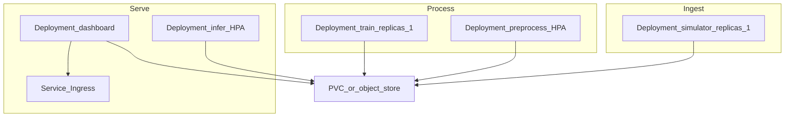

# Dockerizing DashBite & Future Kubernetes Guidance

The repository implements one shared image in [`Dockerfile`](../Dockerfile) and five runtime services plus an isolated test service in [`compose.yaml`](../compose.yaml). See the [README](../README.md#docker-compose) for setup, configuration, persistence checks, and destructive reset commands. Related: [Low-Level Design](./lld-dashbite-ml-pipeline.md).

## Implemented Docker workflow

```bash
docker compose config
docker compose build
docker compose --profile test run --rm --no-deps tests
docker compose up -d
docker compose ps
docker compose logs
docker compose down
```

| Service | Foreground command | Shared storage |
| --- | --- | --- |
| simulator | `python -m pipeline.simulator` | writes `/data/raw` |
| preprocess | `python -m pipeline.preprocess` | reads raw; writes features and quality |
| train | `python -m pipeline.train` | reads features; writes models and training state |
| infer | `python -m pipeline.infer` | reads features and models; writes predictions |
| dashboard | `streamlit run pipeline/dashboard/app.py` | reads features, predictions, and quality |
| tests (profile `test`) | `python -m pytest` | ephemeral `/tmp/dashbite-test-data`, no mounts |

The Python 3.13 slim image installs requirements before copying application source, tests, fixtures, and `pytest.ini` to preserve dependency build caching. `.dockerignore` excludes host environments, runtime data, logs, Git metadata, and caches. Foreground exec-form commands allow Docker to manage each process directly. Only the dashboard publishes a port (`8501`) and binds to `0.0.0.0` in headless mode.

Every runtime service sets `DATA_ROOT=/data` and mounts the same `dashbite-data` named volume. Without an override, local helpers use `<project>/data`; an empty override is unset, and a nonempty override must be absolute. Explicit test `base` arguments retain `base/data` precedence. No storage setting was added to the `Config` dataclass.

Compose demo settings match the Makefile: training threshold 50, batch size 20, polling 15 seconds, corruption rate 0.25, and seed 42. Shell or `.env` values override these numeric settings. Python defaults remain unchanged. Polling handles startup order; a fresh pipeline takes several cycles to create its first checkpoint and predictions.

The tests service shares only the image configuration, has no dependencies or mounts, and returns pytest's status. It can run while application services are absent and cannot alter the live pipeline volume.

`docker compose down` preserves data. Recreating the stack resumes with existing markers, checkpoints, training state, and predictions. `docker compose down --volumes` deliberately deletes this state; use only for disposable data. The image uses its default root user so a fresh named volume is writable by all five runtime services.

Keep **one instance per runtime stage**, including inference. Existing final-file writes and polling can expose partial reads; concurrent writers require additional coordination. Atomic handoffs, graceful shutdown changes, and dashboard health checks are outside this implementation's scope.

---

## Future guidance — Kubernetes (not implemented)

Use the **same image**, different Deployments and commands. Shared storage is the critical design choice.



### Per-component scaling policy

| Image / command | K8s object | Replicas / HPA | Why |
|-----------------|------------|----------------|-----|
| **simulator** | Deployment | **Fixed 1** | Single producer avoids duplicate batches; scale *rate* via `BATCH_SIZE` / `POLL_INTERVAL_SECONDS`, not pods |
| **preprocess** | Deployment + HPA | **1 → N** on CPU or backlog | Scales with ingest volume; needs safe multi-writer pattern (below) |
| **train** | Deployment | **Fixed 1** | Sole writer of checkpoints; multiple trainers race on `train_state.json` |
| **infer** | Deployment + HPA | **1 → M** on CPU or unscored rows | Independent of train; scales with scoring load |
| **dashboard** | Deployment + Service | **1 → 2** | Mostly read-only; put a Service (and optional Ingress) in front |

### Storage options

1. **Local / demo (kind, minikube, single-node):** one PVC with **ReadWriteMany**, or `hostPath`, mounted at `DATA_ROOT` on every pod.
2. **Production-shaped:** keep the same containers, swap directory polling for object storage + queue (e.g. S3 + SQS/Kafka). Only the I/O adapter behind `raw_dir` / `features_dir` changes. Then HPA across nodes is safe.

### Making HPA safe with files (minimal teaching upgrade)

Before setting preprocess/infer HPA above 1 on a shared PVC:

- **Preprocess:** claim a raw file with atomic create of `.claim_<filename>` (or rename into `raw/in_progress/`). Only the claimer writes features + the quality log row.
- **Infer:** claim unscored `order_id`s via markers under `data/predictions/.claims/`, **or** shard with `hash(order_id) % N` using a pod ordinal / StatefulSet index.

**Train** stays at 1 replica. Protect it with a PodDisruptionBudget (`minAvailable: 1`) so it is not evicted mid-checkpoint.

### Example HPA signals

| Component | Scale on |
|-----------|----------|
| preprocess | CPU &gt; 70%, or custom metric `raw_files_pending` |
| infer | CPU &gt; 70%, or custom metric `unscored_feature_rows` |
| simulator / train | No HPA — tune env knobs only |
| dashboard | Optional light HPA; not the bottleneck |

### Suggested manifest layout

```text
k8s/
  namespace.yaml
  pvc.yaml
  configmap.yaml
  deployment-simulator.yaml
  deployment-preprocess.yaml
  deployment-train.yaml
  deployment-infer.yaml
  deployment-dashboard.yaml
  service-dashboard.yaml
  hpa-preprocess.yaml
  hpa-infer.yaml
  pdb-train.yaml
```

Every Deployment uses `image: dashbite:latest`, the same ConfigMap env, and the same PVC mount at `DATA_ROOT`.

Example shape for a scalable Deployment:

```yaml
apiVersion: apps/v1
kind: Deployment
metadata:
  name: dashbite-infer
spec:
  replicas: 1
  selector:
    matchLabels:
      app: dashbite-infer
  template:
    metadata:
      labels:
        app: dashbite-infer
    spec:
      containers:
        - name: infer
          image: dashbite:latest
          command: ["python", "-m", "pipeline.infer"]
          envFrom:
            - configMapRef:
                name: dashbite-config
          volumeMounts:
            - name: data
              mountPath: /app/data
      volumes:
        - name: data
          persistentVolumeClaim:
            claimName: dashbite-data
---
apiVersion: autoscaling/v2
kind: HorizontalPodAutoscaler
metadata:
  name: dashbite-infer
spec:
  scaleTargetRef:
    apiVersion: apps/v1
    kind: Deployment
    name: dashbite-infer
  minReplicas: 1
  maxReplicas: 8
  metrics:
    - type: Resource
      resource:
        name: cpu
        target:
          type: Utilization
          averageUtilization: 70
```

### What not to scale

- Do **not** run multiple **train** pods against one models directory
- Do **not** run multiple **simulator** pods without partitioning (you will duplicate events)
- Do **not** HPA the **dashboard** aggressively — it is not the throughput bottleneck

---

## Teaching narrative

```text
modular processes
  → one image, many commands
    → Docker Compose locally (shared volume)
      → Kubernetes Deployments
        → HPA on preprocess + infer
        → fixed singletons for simulator + train
```

That progression shows how the same DashBite stages move from a laptop demo to independently scalable services without rewriting the ML logic.

---
